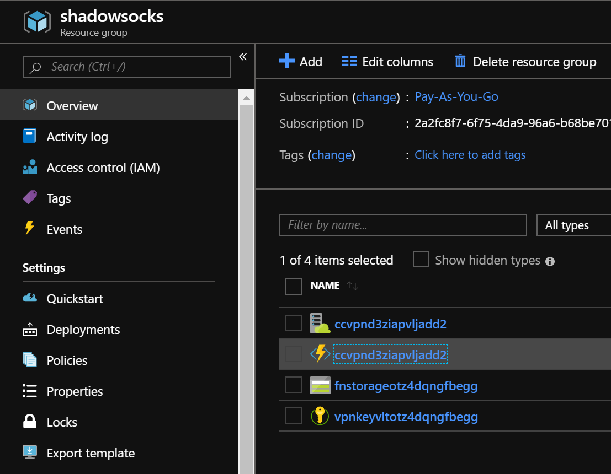
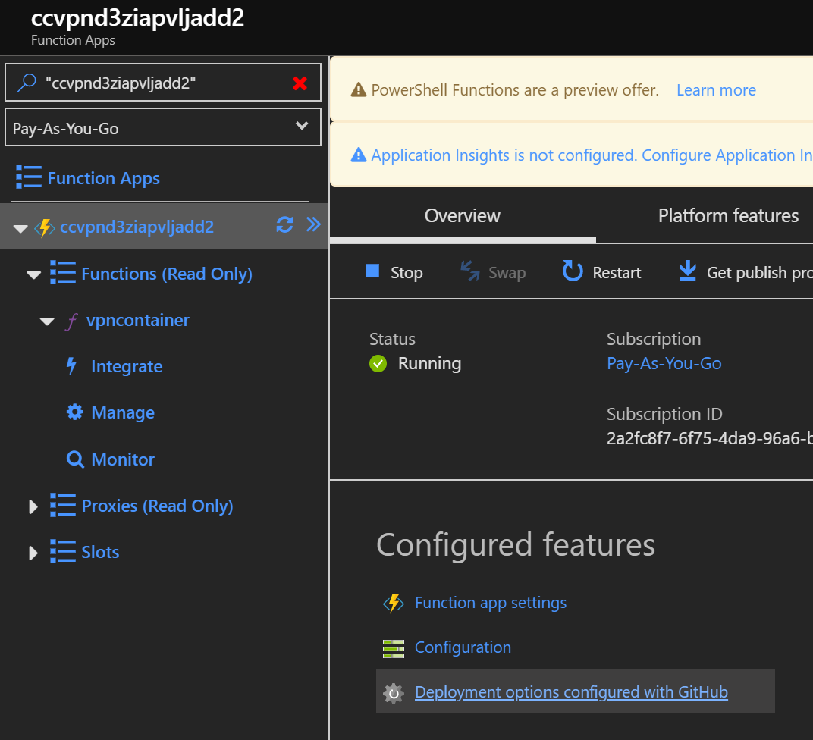
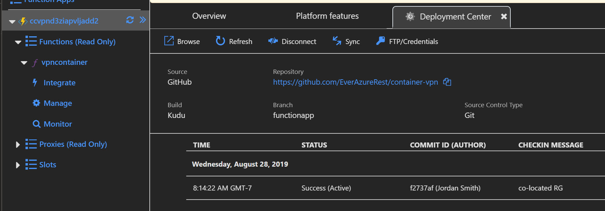
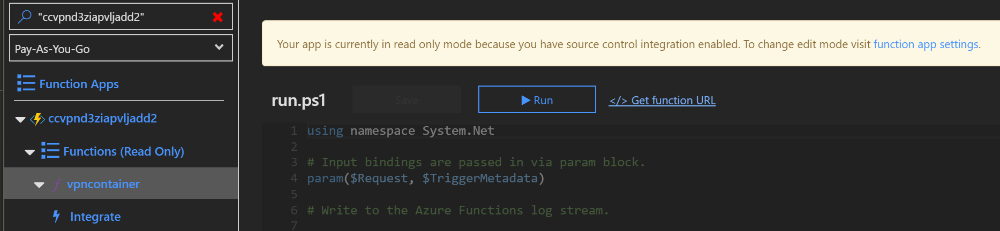

# Azure Container VPN
Create a ShadowSocks SOCKS5 Proxy in an Azure Container Instance Container and run a secure SOCKSv5 connection from any Azure Datacenter!

# About

[Azure Container Instance](https://docs.microsoft.com/en-us/azure/container-instances/) is a small, burstable compute fabric that allows us to deploy our proxy server in a state of ephimeral compute that can be created or destroyed at will without any lingering data.
In other words, a little slice of compute to run the remote side of the proxy without the need for any traditional server, hardware or networking requirements.  This is otherwise known as [Infrastructure as Code](https://en.wikipedia.org/wiki/Infrastructure_as_code)

Using this platform for a [SOCKS5](https://en.wikipedia.org/wiki/SOCKS) proxy server is perfect for those that need a quick connection outside their geographic region or need to escape prying eyes of Governments or ISPs

Azure Container Instances are billed on a per-second basis, therefore this will likely be a cheaper solution for most users who rely on monthly, paid VPN services

# Deployment

There are multiple ways to work with this project, the easiest is to use the [azuredeploy.sh](./azuredeploy.sh) script in this repo to deploy this project. **Note - ensure that you change the password in the [azuredeploy.parameters.json](./azuredeploy.parameters.json) file prior to using this script** and follow the instructions for API deployment in this README.

This will deploy an [Azure Function](https://docs.microsoft.com/en-us/azure/azure-functions/functions-overview) in a free/consumption-based App Service Plan, which will act as an API to create your VPN on-demand.  It will store your passphrase encrypted in [Azure Keyvault](https://docs.microsoft.com/en-us/azure/key-vault/key-vault-overview), then pull the secret into the VPN container when the API is called.

We will delegate access to the [Managed Identity](https://docs.microsoft.com/en-us/azure/app-service/overview-managed-identity) of the FunctionApp and grant access to the Function App for reading the secret in KeyVault and creating the Azure Container Instance resource to run the remote side of the VPN.

You can also follow the quick deployment setup instructions, which will use a script to create/destroy the VPN, and not create an API.

# Dependencies

[git](https://git-scm.com)

[Microsoft Azure](https://portal.azure.com) subscription.  Microsoft gives free 30-day trials for new accounts

Azure [CLI](https://aka.ms/az-cli) and Bash/zsh
    ***OR***
[PowerShell](https://github.com/powershell/powershell) >= 6.1 with [Azure](https://www.powershellgallery.com/packages/Az/1.4.0) Modules installed

[ShadowSocks Client](https://shadowsocks.org/en/download/clients.html)

A Text Editor like Vi, Nano, Notepad, [Notepad++](https://notepad-plus-plus.org/), or my personal favorite editor [Code](https://code.visualstudio.com/)

# Understanding Regions

Microsoft builds Azure Datacenters all over the world in pairs of Datacenters located around Geo-political [Regions](https://azure.microsoft.com/en-us/global-infrastructure/regions/).

It's good to understand where Azure Regions are located in order to know where you can proxy your connection to. 
If you want to proxy your connection to the US for example, you have many regions to choose from like WestUs, EastUS, EastUs2, SouthCentralUS, etc.

To check if Azure Container Instances are available in the Region you want to proxy to:

***PowerShell:***
```powershell
(Get-AzResourceProvider -ProviderNamespace Microsoft.ContainerInstance)[0].locations
```

***CLI:***
```bash
az provider show --namespace Microsoft.ContainerInstance --query "resourceTypes[0].locations"
```

**Just remember to remove the spaces from the names of the Region when you deploy, i.e. East US 2 == eastus2**

# API Deployment

This is the easiest way to work with this project. 
It's recommended that you fork this repo before deploying this way.  

To deploy the API, clone this repository and edit [azuredeploy.sh](./azuredeploy.sh) and change this variable: `export SUBSCRIPTIONID="mySubscriptionIDorName"` to reflect your subscription name or ID.  Edit [azuredeploy.parameters.json](./azuredeploy.parameters.json) and replace the value for the password to one of your choosing. If you fork the repo, make sure to change the URL value for `"sourceCodeRepositoryURL"` and point it to your own public repository. 

When editing "region" in this deployment, please note that this is the region where the resources for API will reside, not where the VPN is going to run.  The region where the VPN will run is a parameter declared when the API is called. 

The source code for the API is in the **FunctionApp** branch of this project repository. 

Once the deployment completes, log into the [Azure Portal](https://portal.azure.com), and find the ***shadowsocks*** (or or the name you specified in the deployment) Resource Group. 

Click on the FunctionApp


Click on Deployment Options


Enable the trust between the forked github repo and the Function App.  This way, if you decide to iterate the Function App code, it will be automatically deployed to the FunctionApp. 

Once this is enabled, you should see a FunctionApp created and automatically deployed from the github repo.  


Click on the FunctionApp.  The code should show up in the preview pane.  Click Get Function URL to get the URL for using the API. 


## API Usage

The URL for the API is unique to your API.  It contains a Key that is included in the URL that will serve as authentication to run the API.  The URL will look similar to the below example

```
https://ccvpnd3ziapvljadd2.azurewebsites.net/api/vpncontainer?code=<key value here>
```
The Request Body of the API call requires a JSON payload and expects two parameters to be declared in the body of the request.  

Accepted parameters are: `action:start/stop` and `region:<azureregion>`.  The region must be a valid region in Azure that supports Azure Contianer Instance.  See **Understanding Regions** in this readme.

Here is an example of an easy integration with Bash and CURL in order to start and stop the VPN using the API from a script.

```bash
ACTION=$1
REGION=$2
URL=<URL to Function API>

if [ $ACTION = "start" ]; then 
DATA={"\action"\:"\start"\,"\region"\:"\$REGION"\}

curl -D $DATA $URL
```

It returns an HTTP status code and JSON payload that contains the FQDN and the IP address of the VPN that can be used to connect the Shadowsocks client to. 

You can use the scripts referenced below to create end-to-end automation using the REST calls instead of the container deployment.  I will update this project at a later time with these examples. 

# Quick Deployment Steps via Script

This will not create an API for future use, or secure your password.  ***Please note that the shadowsocks.conf file created locally will have your password in plain text.  You should take steps to secure this file and/or delete the password value after use.***

This deployment is just a set of scripts that will deploy the VPN into a region you specify, and in the case of Linux, connect you automatically. 

Make sure you authenticate your Azure client to Azure prior to these steps

***PowerShell:*** 
```powershell
Connect-AzAccount
```

***CLI:***
```bash
az login
```

To get your Subscription ID:

***PowerShell:*** 
```powershell
Get-AzSubscription
```

***CLI:***
```bash 
az account show
``` 

Either command will return all the Subscriptions that your account has access to.  The SubscriptionId field is a GUID value and will be copied into the script you run in step 4 of the deployment. You may want to copy and paste that value into a text editor to be referenced during step 4.

The deployment script will take that value and ensure we deploy to the correct subscription

## Windows:

1. Open PowerShell (pwsh.exe) and change to a directory that you can create new directories in. 
```powershell
PS> cd C:\Users\myusername\mydirectory
```

2. Clone this Repo into that folder with git
```
PS> git clone https://github.com/EverAzureRest/container-vpn.git
```

3. Change into the Repo Directory
```powershell
PS> cd container-vpn
```

4. edit ***simple_deployment/quickdeploy.ps1*** using a text editor, and where you see `$SubscriptionID="mySubscriptionGUID"` replace "mySubscriptionGUID" with your subscription Id, leaving the quotes - see the above section about retrieving your SubscriptionId.
We do this to ensure we are deploying to the desired Azure Subscription as it is possible to have many Subscriptions.
Make sure to **save your changes to the file before continuing**

5. In PowerShell run the script to deploy the server where `<password>` is your desired password to connect to the proxy server and `<region>` is the Azure Region you want to proxy your connection through
```powershell
simple_deployment/quickdeploy.ps1 -password <password> -region <region>
simple_deployment/quickdeploy.ps1 -password weakpassword -region eastasia
```

6. Connect your ShadowSocks client to the public IP address returned using your password from step 5 and aes-256-cfb cypher - options in the shadowsocks GUI

7. To delete/stop the server, run in PowerShell:
```powershell
simple_deployment/quickdeploy.ps1 -delete
```

## Linux: (may work on Mac - but untested)

1. Open any bash or zsh shell terminal and change to a directory to clone the Repo into
```
cd ~/src
```

2. Clone this Repo with git
```bash
git clone https://github.com/EverAzureRest/container-vpn.git
```

3. Change into the Repo Directory
```
cd container-vpn
```

4. edit ***simple_deployment/quickdeploy.sh*** using a text editor, and where you see `export SUBSCRIPTION="mySubscriptionId"` replace "mySubscriptionId" with your subscription Id, leaving the quotes - see above about retreiving your SubscriptionId.
We do this to make sure you are deploying to the right Azure Subscription as it is possible to have many Subscriptions.
Make sure to **save your changes to the file before continuing**

5. run the script to deploy the server where `<password>` is your desired password to connect to the proxy server and `<region>` is the Azure Region you want to proxy your connection through.
```bash
bash simple_deploy/quickdeploy.sh -p <password> <region>
bash simple_deploy/quickdeploy.sh -p weakpassword japaneast
```

6. If ShadowSocks is installed, it will connect automatically

7. To disconnect the client and delete the server, run 
```bash 
bash simple_deployment/quickdeploy.sh -stop
```

# Connecting to the VPN

Configure your browser to use a ***SOCKS5*** proxy at 127.0.0.1:1080 - [Firefox Instructions](https://www.howtogeek.com/293213/how-to-configure-a-proxy-server-in-firefox/), [Chrome Instructions](https://productforums.google.com/d/msg/chrome/9IDWpZ5-RAM/v68jStH77loJ)
   
# Credits

[Oddrationale](https://hub.docker.com/r/oddrationale/docker-shadowsocks) on [Docker Hub](https://hub.docker.com/) for the container image